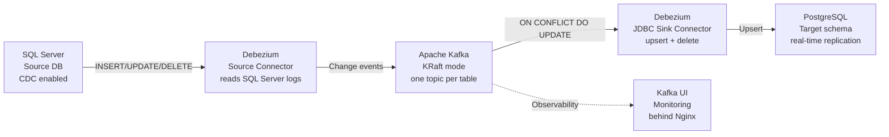

# CDC: SQL Server → PostgreSQL via Apache Kafka + Debezium

Real-time **Change Data Capture (CDC)** pipeline that streams every row
change from a SQL Server source database into a PostgreSQL target
schema, using **Apache Kafka** as the streaming backbone and
**Debezium** for log-based change capture.

## Architecture



## Stack

| Component       | Version | Role                              |
|-----------------|---------|-----------------------------------|
| Apache Kafka    | 4.3.0   | Message broker (KRaft mode)       |
| Debezium        | 3.5.2   | CDC Source + JDBC Sink            |
| Kafka UI        | 0.7.2   | Visual monitoring                 |
| Nginx           | 1.28.x  | Reverse proxy + access logs       |

## What this project solves

- **Real-time replication** of operational data from SQL Server to PostgreSQL
  without polling or batch windows.
- **Decoupled consumers** — Kafka topics can serve additional consumers
  (analytics, data lake, search index) beyond PostgreSQL.
- **Operational visibility** via Kafka UI, Nginx access logs, and
  Docker Compose.
- **Tunable retention** per topic to control disk usage.

## Repository structure

```
cdc-sqlserver-postgres-kafka/
├── LICENSE                   # MIT
├── README.md                 # This file
├── .env.example              # Credential placeholders
├── .gitignore
├── kafka/                    # Kafka KRaft installation & tuning notes
├── debezium/                 # Source & Sink connectors + Docker Compose
├── kafka-ui/                 # Kafka UI setup
├── nginx/                    # Reverse proxy configuration
└── runbook/                  # Operational guide & troubleshooting
```

## Prerequisites

Before deploying this pipeline you need:

### SQL Server
- A user with `db_owner` privileges (or equivalent) on the source database.
- CDC enabled at the database level (`sys.sp_cdc_enable_db`).
- CDC enabled on every table you want to replicate
  (`sys.sp_cdc_enable_table`).
- **SQL Server Agent running** — required by CDC to scan the
  transaction log [1].

### PostgreSQL
- A target database and schema already created.
- Tables mirroring the source schema with **`PRIMARY KEY`** defined
  on each one. Use your preferred migration tool to create the
  schema and the PKs before starting the Sink connector.

### Linux host (Ubuntu 22.04+)
- Docker + Docker Compose v2
- Java 17+ (for Apache Kafka)
- At least 4 vCPU, 8 GB RAM, 50 GB free disk for a small setup

## Quick start

```bash
# 1. Clone the repository
git clone https://github.com/<your-user>/cdc-sqlserver-postgres-kafka.git
cd cdc-sqlserver-postgres-kafka

# 2. Copy the environment template and fill in your credentials
cp .env.example .env
$EDITOR .env

# 3. Install Apache Kafka (KRaft) — see kafka/README.md
# 4. Start Debezium and Kafka UI — see debezium/README.md
# 5. Register Source and Sink connectors — see debezium/README.md
```

For step-by-step instructions on each component, follow the README in
each subdirectory.

## Documentation map

| Topic                                | Where to go                          |
|--------------------------------------|--------------------------------------|
| Apache Kafka KRaft install & tune    | [`kafka/README.md`](./kafka/)        |
| Debezium Source & Sink connectors    | [`debezium/README.md`](./debezium/)  |
| Kafka UI setup                       | [`kafka-ui/README.md`](./kafka-ui/)  |
| Nginx reverse proxy & logs           | [`nginx/README.md`](./nginx/)        |
| Troubleshooting & runbook            | [`runbook/README.md`](./runbook/)    |

## References

- [Apache Kafka documentation](https://kafka.apache.org/documentation)
- [Debezium SQL Server Connector](https://debezium.io/documentation/reference/stable/connectors/sqlserver.html)
- [Debezium JDBC Sink Connector](https://debezium.io/documentation/reference/stable/connectors/jdbc.html)
- [Kafka Connect REST API](https://docs.confluent.io/platform/current/connect/references/restapi.html)
- [Kafka UI (Provectus)](https://github.com/provectus/kafka-ui)
- [PostgreSQL COPY](https://www.postgresql.org/docs/current/sql-copy.html)

## License

MIT — see [LICENSE](./LICENSE). Use it, fork it, adapt it for your
own CDC pipelines.

## Author

Built as a real-world reference for SQL Server → PostgreSQL CDC.
Suggestions and PRs are welcome.
